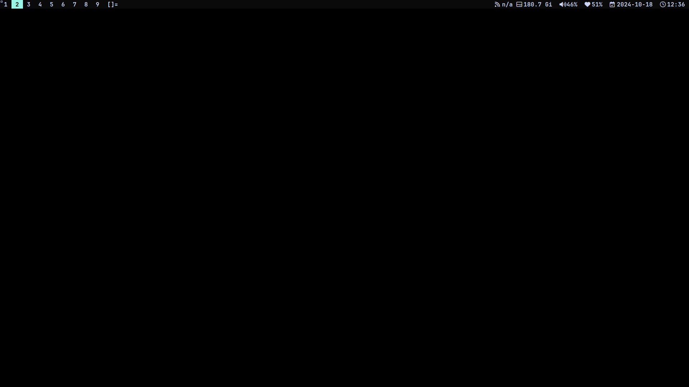

# dwm

This project inspired from maxhu08 project dwm-rev1 `dwm-6.5`. Lil change on it, make it more simple

## patches

- `movestack` https://dwm.suckless.org/patches/movestack
  - makes it so that MOD+J & MOD+K moves windows up & down the stack (better than stacker)
- `resizehere` https://dwm.suckless.org/patches/resizehere
  - prevents mouse from warping to bottom right corner when resizing window
- `vanitygaps` https://dwm.suckless.org/patches/vanitygaps
  - provides adjustable gaps with keybinds and more layouts
- `statusallmons` https://dwm.suckless.org/patches/statusallmons
  - makes it so that status bar gets updated on all monitors instead of just the focused one
- `pertag` https://dwm.suckless.org/patches/pertag
  - preserves mfact and other stuff per tag
- `tiledmove` https://dwm.suckless.org/patches/tiledmove
  - makes it so MOD+lmb allows windows to stay tiled while moving them
- `unfloatvisible` https://dwm.suckless.org/patches/unfloatvisible
  - make floating window tiled again with MOD+Z
- `status2d` https://dwm.suckless.org/patches/status2d
  - add color support and more to dwm status bar
- `setborderpx` https://dwm.suckless.org/patches/setborderpx
  - make it so that MOD+{ & MOD+} decrease and increase the border width
- `alwayscenter` https://dwm.suckless.org/patches/alwayscenter
  - makes it so that floating windows always start centered instead of in the top-left corner, also changed it to take into account the height of the bar
- `actualfullscreen` https://dwm.suckless.org/patches/actualfullscreen
  - make its so that MOD+f makes window fullscreen

## quick-start

to get started run these commands:

```
git clone https://github.com/emenodon/nub-dwm
cd dwm
sudo make clean install
```

then add this to your `~/.xinitrc`

```
exec dwm
```

## showcase


